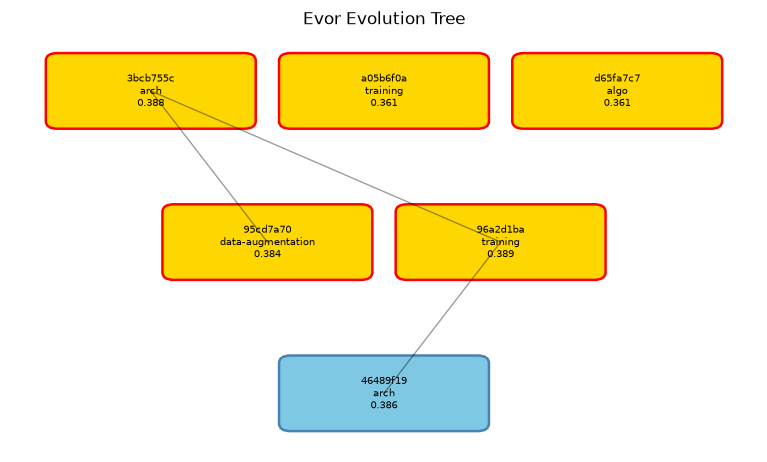

<div align="center">

# 🧬 oh-my-evor

### Autonomous ML-research evolution engine for Claude Code — *that proves its own results are real.*

[](https://code.claude.com)
[](https://opensource.org/licenses/MIT)
[](#-proof-it-works)
[](#architecture)
[](#the-reflex-layer)
[](#the-agent-roster)



<sub>*A real evolution tree from a run — each node is a candidate model (approach family + score), and every score shown has already survived the integrity gate. Rendered by the `/oh-my-evor:evor-report` skill.*</sub>

</div>

---

oh-my-evor turns Claude Code into a team of specialist AI agents that **autonomously evolve a machine-learning model** — proposing, critiquing, implementing, training, and evaluating candidates through an iterative mutation **tree search**. After a single setup conversation, it runs to your goal with **zero human-in-the-loop**.

But autonomy is cheap. The hard part is *trust*. So oh-my-evor is built around one non-negotiable idea:

> **Every reported gain must be provably real.** No test-set leakage. No reward-hacking. No irreproducible flukes. No moving the goalposts.

---

## ⭐ Why oh-my-evor?

Most "AI improves your model" tools hand you a number and ask you to trust it. An autonomous agent optimizing a metric will happily — and invisibly — **cheat**: peek at the test set, overfit the validation split, silently swap the eval, or report a lucky seed. oh-my-evor is engineered so it *structurally cannot*:

| The trap | How oh-my-evor closes it |
|---|---|
| 🕵️ **Test-set leakage** | Frozen splits are `chmod 444`; a 13-check **integrity gate** flags near-perfect scores and per-step val spikes as leakage signatures |
| 🎰 **Reward hacking** | Direction-aware anti-gaming checks (works for higher- *and* lower-is-better metrics); the gate may never auto-weaken its own fraud detection |
| 🔒 **Agents editing the referee** | A **hook-enforced capability governor** + an always-on **write-guard** make it impossible for any agent to write the evaluator, touch frozen splits, hand-edit run state, or run training out of turn — enforced at the tool-call layer, not by prompt politeness |
| 📉 **Comparability drift** | Eval-version is pinned; hardening the test bumps the version and re-scores comparably — never a silent swap |
| 📎 **Hand-wavy research** | Every SOTA claim the research agent makes is **anchored to a source URL** — no citation, no claim |

The result is an engine you can point at a real dataset and *leave alone* — and still defend the number it gives you.

---

## 🚀 Quick Start

**Install in two commands:**

```text
/plugin marketplace add https://github.com/it-dainb/oh-my-evor
/plugin install oh-my-evor
```

The MCP server ships **prebuilt** (no Node build on your machine), and the bundled research MCPs provision their own isolated Python on first use. When you enable the plugin, Claude Code **prompts once for an optional Hugging Face token** (stored in your keychain) — leave it blank for anonymous access. The compute harness needs its Python deps once; `./install.sh` installs them and pre-warms the research MCP environments:

```bash
./install.sh    # installs harness deps (pydantic, pyyaml, …) + pre-warms the bundled MCP venvs
```

> If anything is missing, oh-my-evor tells you exactly what to run on your next session — it never fails cryptically.

> **Using a virtualenv or a non-default Python?** The MCP server runs the compute harness through the interpreter named by the `EVOR_PYTHON` environment variable (default: `python3`). If you install the harness deps into a venv or any interpreter other than the default `python3` (e.g. `EVOR_PYTHON=/path/to/venv/bin/python ./install.sh`), export that **same** `EVOR_PYTHON` in the environment where you launch Claude Code. Otherwise the server falls back to bare `python3`, which won't have the deps, and harness-backed tools (setup, freeze, preflight, run) will report a missing-dependency error.

Then start a mission — **one setup conversation** (a structured interview) locks the goal, metrics, and benchmark; after that it runs autonomously:

| Command | What it does |
|---|---|
| `/oh-my-evor:evor-setup` | New mission: guided interview → GoalContract → freeze splits → consent. **The only human-in-the-loop step.** |
| `/oh-my-evor:evor-run` | Launch (or resume) the autonomous tick loop toward the goal |
| `/oh-my-evor:evor-schedule` | Run unattended for hours or days — the session sleeps between ticks and wakes to advance |
| `/oh-my-evor:evor-resume` | Restore a specific paused run by id and continue |
| `/oh-my-evor:evor-dashboard` | Live **FastAPI + SSE dashboard** — D3 evolution tree, telemetry charts, coverage gauge |
| `/oh-my-evor:evor-report` | Final report: tree, frontier table, lessons, static HTML export |

---

## How it works

Each **tick** of the outer loop runs a disciplined pipeline, and the loop repeats until the goal is met:

```
   research → dream → gate → implement → train → evaluate → integrity → select → learn
   (Sage)   (Mutagen)(Selector)(Forge)         (harness)   (gate)    (Selector) (wiki)
      └──────────────────────────── repeat until goal reached ───────────────────────┘
```

- **Tree search**, not greedy hill-climbing — candidates branch, cross over, and get pruned via UCB1 scoring, so the engine explores the frontier instead of chasing one lucky lineage.
- **Signals** flow to every agent: OOM, slow-training, overfit, plateau, gradient-explosion, budget-burn and other pain-points are captured, deduped, and routed through a shared bus so the next proposal *reacts* to what actually happened.
- **Read-first discipline** — every agent reads the previous step's artifact through MCP before acting, so lineage never breaks and no step works from stale memory.
- **Validate before the costly run** — Forge lints the candidate (LSP) and fans out a critic + analyst + architect review *in parallel* before a single training hour is spent.
- **Compaction-survival** — state is flushed before context compaction and re-hydrated after, so long autonomous runs don't lose their thread.
- **A live dashboard** streams the evolving tree and telemetry over SSE while the loop runs.

### The Agent Roster

The orchestrator (**Evor**) runs as the main Claude Code session. It spawns specialist leads — and those leads spawn their *own* sub-teams (a real hierarchy, not one agent role-playing six):

| Agent | Role | What it does |
|---|---|---|
| **Evor** | Orchestrator | Runs the tick loop, meta-evolution, doom-loop detection; spawns leads. Opus. |
| **Sage** → *Sage-juniors* | Research lead | Citation-backed SOTA findings; fans out research by angle. Every claim carries a source URL. |
| **Mutagen** | Dreamer | Mutation proposals across `arch / training / data-* / algo`, driven by a wildness dial. Never researches — stays anchoring-free. |
| **Probe** | EDA / Analyst | Structured telemetry checks (loss curve, gradient health, LR sensitivity, error clustering) to confirm or refute the hypothesis. |
| **Forge** → *architect / junior / critic / analyst* | Implementation lead | A dev-team that scaffolds the genome in an isolated git worktree, reviews before running, and launches training. **Only the junior writes code.** |
| **Selector** | Critic | Hard gates on every proposal before a training run is spent. Errs toward rejection. |
| **Acquirer** | Data | Fetches enrichment/hardening data under strict no-leakage rules. |

*Children are spawnable **only** by their parent — enforced by the governor hook.*

---

## 🧰 MCP-native — the harness is invisible

Every agent operates through **one surface: ~40 `evor_*` MCP tools.** Agents never write `.evor/` state by hand, never shell out to a CLI, and never touch the Python harness directly — they don't even know it exists. A single reference skill (`evor-mcp`) auto-loads the tool catalog into every agent like muscle memory.

Why this matters:

- **Controllable & lineage-safe** — a direct file write is un-auditable and a model can forget it. Every mutation and read flows through a validated, atomic tool, so the mission's lineage, guards, and stop-conditions always hold.
- **Guard-enforced** — a `PreToolUse` write-guard *structurally* denies any direct `.evor` write or harness call and points the agent to the right tool. Agents can't drift off the sanctioned path even if they try.
- **Read-first** — agents read upstream artifacts through MCP before acting; a missing upstream read is a hard stop, never a fabrication.

The MCP tools cover the whole loop: `init_run`, `record_node`, `record_eval`, `integrity_check`, `tree_read`, `select`, `write_artifact`/`read_artifact`, `state_read`/`state_write`, `signal_emit`/`query`/`digest`, `run_start`/`run_status`, `store_patch`/`store_blob`, `write_handoff`/`read_handoff`, `cite`, `wiki_*`, `gotcha_*`, and the compute wrappers — **39 in all**.

---

## ⚡ The Reflex Layer

The tools are the vocabulary; **14 lifecycle hooks are the reflexes** that turn them into a guided, self-validating pipeline:

- **Spawn-time briefing** — each specialist gets its Law, read-first discipline, and role-specific protocol injected the instant it spawns (`SubagentStart`), so shared knowledge lives in one hook instead of duplicated across every agent file.
- **Next-step nudges** — after each tool, the model is guided to the optimal next action (launch training → watch it → record → integrity-check → learn), so the chain can't be forgotten.
- **Never block on a run** — `evor_run_start` launches training detached; a plugin-provided **background monitor** streams progress and failure signatures back to Claude, and away-from-keyboard events (a finished run, an OOM, a breakthrough, a human-gate) fire a push notification.
- **Runs for days** — an attended run is watched live; an unattended one lets the session **sleep between ticks and wake to advance** (`FileChanged`/`Cron`/`ScheduleWakeup`), so a multi-day mission needs no babysitting.
- **Recovery** — state is flushed before compaction and re-injected after, and the loop resists stopping mid-tick with an escalating, always-overridable nudge.

---

## 🛡️ The Integrity Gate — the part that makes it trustworthy

This is the heart of the project. Before any candidate's result is allowed to count, it passes a **13-check integrity gate** in the Python harness. A few of the checks:

- **Leakage detection** — near-ceiling scores on a hard task, or a sudden per-step validation spike, are flagged as test-leakage signatures.
- **Reward-hacking, direction-aware** — a legitimate jump from a weak baseline is *allowed*; a near-perfect leak is *rejected* — and the check knows whether higher or lower is better.
- **Frozen-split & eval-version** — the test split hash and eval script are locked; results only compare within the same evaluation contract.
- **Ingestion contamination** — for `data-acquisition` candidates, acquired data must share zero samples with the frozen eval split or the node is rejected.
- **Reproducibility & structure** — outputs must match the declared shape and re-derive.

A `failed` verdict marks the node and permanently excludes it from the frontier — `failed` nodes are never deleted from `tree.json`, only marked. Paired with the **capability governor**, the **write-guard**, and a **monotonic-honesty invariant** (the engine may never weaken its own fraud detection), the gate is what lets oh-my-evor be *aggressive and autonomous* without becoming *untrustworthy*.

---

## 🔬 Proof it works

We hold ourselves to the same standard we hold the agents to — **claims are backed by evidence you can reproduce**:

**✅ 1150 automated tests pass** — the safety-critical logic is covered, not asserted.
```bash
cd mcp && npx vitest run          # 465 passing  (MCP server, 39 tools, 14 hooks, governor, write-guard)
python -m pytest harness/tests -q # 685 passing  (integrity gate, signals, tree search, evaluator, telemetry)
```

**✅ MCP-native, verified.** Every agent, skill, and command was migrated onto the `evor_*` tools and audited to **zero** direct-`.evor`-write or harness-CLI references — the harness is genuinely invisible to the agent layer, enforced by the write-guard and a repo-wide grep gate in CI.

**✅ Real evolution artifacts.** The tree at the top of this page is not a mock-up — it's a rendered run where candidates were scored and integrity-gated, and the best emerged from a genuine branching search.

**✅ Adversarially audited.** The codebase was put through repeated multi-agent audits that root-cause-fixed dozens of real defects (silent data loss, a dead signal pipeline, dead circuit-breakers, leakage-check false-negatives, lineage gaps) — each fix locked in by a proving test.

---

## Architecture

| Layer | What | Detail |
|---|---|---|
| **Orchestration** | Skills + agents | `/oh-my-evor:*` skills, 11 hierarchical agents, one auto-loading `evor-mcp` reference skill, Autonomy Charter (never-halt, monotonic-honesty) |
| **MCP server** | **39 tools** (TypeScript, prebuilt bundle) | The complete agent surface — lifecycle, tree/select, artifacts, state, signals, run/compute, citations, wiki, gotchas, handoffs |
| **Compute harness** | Python | Integrity gate (13 checks), tree engine (UCB1 + crossover + prune), signal bus, evaluator, telemetry, live dashboard — reached **only** via MCP |
| **Reflex layer** | **14 lifecycle hooks** | Capability governor + `.evor` write-guard, per-role spawn injection, next-step reflexes, run-watching, compaction flush/rehydrate, stop-guards |
| **Bundled MCPs** | Research | Semantic Scholar, arXiv (isolated, auto-provisioned Python) + Hugging Face (token via plugin config) |

State for every mission lives under `.evor/runs/<mission>/<run-id>/` — `goal-contract.json` (immutable spec), `tree.json` (all candidates, never deleted), `run-state.json`, `decision-log.md`, `frozen-splits/`, and content-addressed `artifacts/` — all written **only** by MCP tools.

---

## Requirements

- **Claude Code** (the plugin host)
- **Node ≥ 18** — runs the MCP server + hooks (ships prebuilt; no build needed)
- **Python ≥ 3.10** — the compute harness (deps installed once via `./install.sh`); the bundled research MCPs auto-provision their own Python
- For real training missions: your own compute stack (e.g. `torch`, `torchvision`); GPU optional (CPU fallback supported)

---

## References

oh-my-evor's search and integrity machinery build on established work:

1. Auer, Cesa-Bianchi & Fischer. *Finite-time Analysis of the Multiarmed Bandit Problem.* Machine Learning, 2002. — the UCB1 scoring behind node selection.
2. Kocsis & Szepesvári. *Bandit Based Monte-Carlo Planning.* ECML, 2006. — the UCT / Monte-Carlo tree-search framing of the evolution tree.

The research agent (**Sage**) additionally anchors every in-run SOTA claim to a live source URL — citation is a hard requirement of the pipeline, not a nicety.

---

## License

MIT — see [LICENSE](LICENSE).

<div align="center">
<sub>Built for <a href="https://code.claude.com">Claude Code</a>. Autonomous research you can actually trust.</sub>
</div>
